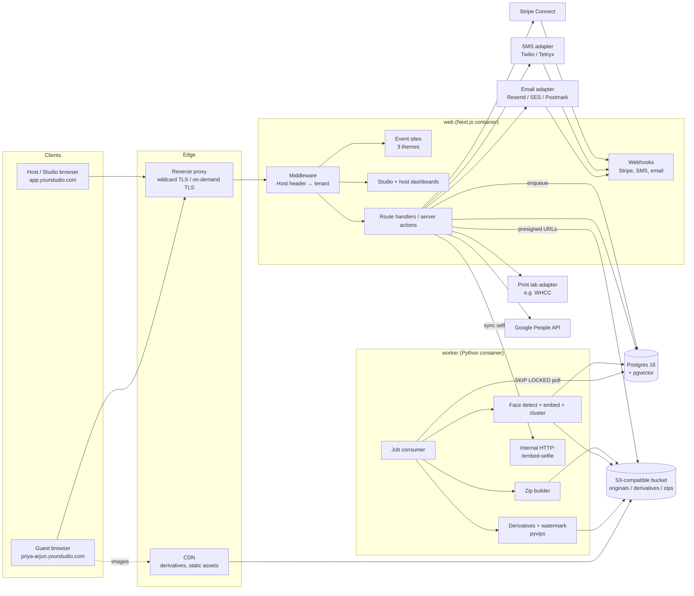
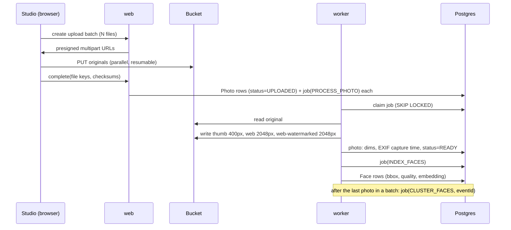

# 01 — Architecture

## 1. System overview



There are two deployable services, `web` and `worker`, plus Postgres and a bucket. Everything else is an external API behind an adapter interface.

## 2. Provider-agnostic rules

| Concern | Portable choice | Why |
|---|---|---|
| Compute | Docker images. Next.js `output: "standalone"`. | Runs on Fly, Railway, Render, ECS, Cloud Run, Hetzner + Coolify, or a bare VPS |
| Database | Plain Postgres 16+ with the `pgvector` extension | Offered by every managed Postgres (Neon, Supabase, RDS, Cloud SQL, Crunchy), and self-hostable |
| Object storage | S3 API only, via `@aws-sdk/client-s3` and `boto3` with a configurable endpoint | Works with R2, S3, B2, Wasabi, and MinIO locally. **R2 is recommended for production because it has zero egress fees**, and photo delivery is mostly egress. |
| Queue | A Postgres `job` table consumed with `FOR UPDATE SKIP LOCKED` | No Redis or SQS dependency. Both Node and Python can produce and consume it. |
| Scheduler | A `job.run_at` column plus a 1-minute tick in the worker | Covers SMS reminders and retention purges without a cloud cron |
| TLS / routing | Caddy or Traefik in front, with wildcard certs via DNS-01 and on-demand TLS later for custom domains | No load-balancer lock-in |
| Email, SMS, print, payments | A TypeScript interface per capability (`EmailSender`, `SmsSender`, `PrintLab`, `PaymentProvider`) | Swapping vendors means writing one adapter. Stripe is the one deliberate exception: payments are built against Stripe directly, behind a thin interface. |
| Secrets / config | 12-factor environment variables | |

Local development runs as one `docker compose` stack: Postgres + pgvector, MinIO, Mailpit (catches all email), the worker, and `stripe listen` for webhooks.

## 3. Tenancy and request routing

```
Platform
└── Studio            (you today; other photographers later)
    └── Event         (one site + one gallery)
        └── SubEvent  (haldi, mehndi, sangeet, ceremony, reception…)
```

- **Hostname resolution.** Next.js middleware reads `Host`, looks it up in the `Domain` table (cached in-process for about 60 seconds), and rewrites to `/_sites/[eventId]/…`. `app.yourstudio.com` routes to the dashboards.
- **DNS.** Use one wildcard record, `*.yourstudio.com`, pointing at the proxy, and one wildcard cert issued with a DNS-01 challenge.
- **Moving to SaaS.** A second studio gets either `{event}.{studio}.yourplatform.com` or its own root domain. The `Domain` table already maps any hostname to an event or a studio. Custom root domains use Caddy on-demand TLS with an `ask` endpoint that checks the `Domain` table.
- **Data isolation.** Every tenant table carries `studioId`, and event-owned tables also carry `eventId`. All queries go through a Prisma client extension that injects the current tenant scope, so there are no raw unscoped queries in route code. Postgres row-level security can be added before outside studios sign on (see the plan).
- **Sessions across subdomains.** The session cookie is set on `.yourstudio.com`, so one login works on every event site. Custom root domains can't share that cookie, so they will need a redirect handshake through `app.` (Phase 3).

## 4. Event sites and themes

- There are fixed page types: Home, Our Story/About, Schedule, Travel & Stay, Wedding Party, FAQ, Registry, Gallery, and RSVP. Each page type has a typed content schema stored as JSON and validated with Zod.
- **All three themes ship in the MVP.** To keep that affordable, themes share one set of headless page components (data loading, RSVP form logic, gallery grid, lightbox). A theme supplies only its layout shells, typography, ornaments and tokens. A Storybook-style theme gallery renders every page in every theme × every locale for visual review.
- **Studio credit.** Every theme's footer shows "Photography by {Studio}", linking to the studio site, with content taken from `Studio.brandJson`. Hosts can't remove it.
- **Access.** **The whole event site is private.** Every page requires an invited-guest session from a magic link or a sign-in code, or an event or studio membership. There are no public pages and no PIN or share links.
  - **Signed-out visitors** see only a themed sign-in screen: names, monogram and a "Enter your email or phone" form. Entering an address sends a one-time code **only if** that address is on the guest list. The response is always the same ("If you're on the guest list, we've sent you a code"), so the form can't be used to find out who's invited.
  - **Crawlers:** the site sends `noindex` and `nofollow`, and `robots.txt` disallows everything on event subdomains.
  - **Shared links:** Open Graph previews (when someone pastes the link into WhatsApp) show only the sign-in screen's title and monogram. They never show content or photos.
- **Themes** are React component sets that render the same typed page data:
  - `luxury`
  - `romantic`
  - `hindu-traditional`

  Each theme exposes design tokens (palette, fonts, ornaments, hero layout). The host can change accent colors, the hero image and the monogram. Layout is not editable.
- **i18n.** UI strings come from message catalogs (`next-intl`) in `en`, `te` and `hi`. Host-authored content is stored as `LocalizedText` JSON (`{ "en": "...", "te": "...", "hi": "..." }`) and falls back to the event's default locale. Every theme must ship Noto fallback fonts for Telugu and Devanagari, and every theme must be tested in all three scripts, because Telugu text is taller and longer than English.
- **Rendering.** All event pages render dynamically after the middleware session check, because nothing is public. Page *content* is cached on the server per event with `unstable_cache` or `"use cache"`, tagged `event:{id}`, and invalidated on edit. Output is never cached in a shared CDN layer, and responses are sent with `Cache-Control: private`.

## 5. Photo pipeline



- **Storage layout.**
  - Originals: `s/{studioId}/e/{eventId}/orig/{photoId}.{ext}`
  - Derivatives: `…/d/{photoId}/{variant}-{rand}.jpg`

  The random suffix makes derivative URLs unguessable, so revoking access means rotating the key.
- **Serving.**
  - **Thumbs and watermarked web images** are served through the CDN with long cache lifetimes and unguessable keys.
  - **Clean web-size images** use short-lived presigned GETs, issued only after an entitlement check.
  - **Originals** are presigned GETs with a 5-minute TTL, issued only after an entitlement check. Originals never go through a public CDN path.
- **Hiding.** Hiding a photo or album removes it from listings and face results immediately. The derivative key is also rotated, so a URL that was already shared stops working.
- **Zips.** A `BUILD_ZIP` job streams originals into a zip64 archive in the bucket, split into parts of 2 GB or less. The user gets the link by email and in the UI. Built zips are cached until the next upload or visibility change. A 2,000-photo event can reach 30 GB or more, so never build zips inside a web request.
- **Throughput.** On CPU, derivatives take about 0.3 s per photo and face detection plus embedding about 0.3–0.6 s, so 2,000 photos finish in roughly 20–30 minutes on a 4-vCPU worker. A GPU is optional. Scale out by running more worker replicas.

## 6. Face search (self-hosted)

### Pipeline

1. **Detect and embed.** Each READY photo gets a face detector run on a downscaled copy. Faces get filtered by size and blur score, aligned, and embedded with a recognition model. The worker stores `Face(bbox, quality, embedding vector(D), modelVersion)`.
2. **Cluster per event.** HDBSCAN (or agglomerative clustering on cosine distance) groups an event's faces into `FaceCluster`s, so each cluster roughly corresponds to one person. Matching a selfie against a cluster instead of individual faces improves recall on side profiles and poorly lit shots.
3. **Search.**
   1. The guest gives consent and takes a selfie.
   2. `web` posts the selfie to the worker's internal `/embed-selfie` endpoint, which returns the embedding within about a second.
   3. `web` runs the match in SQL against that event's faces. The query is filtered by `eventId`; at no more than about 15,000 faces per event, an exact scan takes milliseconds and no ANN index is needed.
   4. The best-matching clusters above the threshold produce a photo list.
   5. That list is filtered to photos the viewer is allowed to see.
   6. The list is saved as `PhotoMatch` rows.
   7. **The selfie image is never written to storage, and its embedding is discarded,** unless the searcher opted into a face profile (below).
4. **Re-matching.** If photos are added after a guest has searched, `PhotoMatch` can only be refreshed from a face profile. Without one, the UI offers "search again".

### "Remember my face" (opt-in face profile)

- **Opting in.** A separate, unticked checkbox on the consent screen ("Remember my face so I'm found automatically in future galleries") creates a `FaceProfile` holding the selfie **embedding**, never the image. The profile is tied to the user, not the event, and has its own consent record.
- **Automatic matching.** It runs when either of these happens:
  - A `CLUSTER_FACES` job finishes for an event where the user has a linked guest row.
  - The user is linked to a new event whose gallery is already indexed.

  Either way, the platform matches the profile and notifies the user: "We found 23 photos of you at Priya & Arjun's wedding."
- **Scope.** A profile is only ever matched against events the user is a guest or member of. There is no cross-event lookup like "who is this face?", and studios can't query profiles.
- **Retention.**
  - Revoking the profile from account settings deletes it immediately.
  - A profile unused for 3 years is purged automatically. The purpose (future events) is treated as expired at that point, which keeps the platform inside CUBI's one-year destruction rule.
- **Model upgrades.** Embeddings can't be converted between models, and the image was never kept. After a model change, a profile is marked stale and the user is asked for a fresh selfie the next time they visit.
- **Adults only.** Profiles can't be created for minors.

### Searching for a child (guardian search)

- **Who can do it.** An adult signed into a household can run a search **on behalf of a child guest (`isChild`) in the same household**.
- **Consent.** The adult gives guardian consent ("I am this child's parent or legal guardian…"). The record stores both the subject (the child's guest record) and the person consenting.
- **Results.** Matches are saved against the **child's guest record**, not the adult's user account. The household sees them on a "Family photos" tab.
- **No profile.** The child's selfie is processed in memory only and no profile is ever created, so every search for a child uses a fresh selfie.
- **Legal review.** COPPA applies to online services that collect personal information from children under 13. Here the information comes from a consenting parent, not from the child directly. Include this flow in the attorney review.

### Model licensing (decision needed)

> InsightFace's *code* is MIT-licensed, but its widely used pretrained weights (`buffalo_l`, ArcFace r100) are released **for non-commercial research only**. A paid photo product needs either a commercial licence from InsightFace or different weights.

| Option | Licence | Quality | Notes |
|---|---|---|---|
| **YuNet (detect) + SFace (embed)**, from OpenCV Zoo | MIT / Apache-2.0 | Good. Below ArcFace on hard angles. | 128-d embeddings, CPU-friendly, ONNX, no licensing friction. **Recommended starting point.** |
| InsightFace with a commercial licence | Paid | Best | 512-d. Contact InsightFace for terms. |
| Self-trained ArcFace on a commercially usable dataset | Depends on the dataset | Varies | Not worth it at this stage |

The schema stores `modelVersion` and the embedding dimension, so switching models means re-indexing events. That's cheap, because originals are kept.

### Biometric privacy (Texas CUBI, Bus. & Com. Code §503.001)

CUBI requires **informed consent before capturing a biometric identifier** for a commercial purpose. It bans selling the data, and it requires destruction within a reasonable time, **no later than one year after the purpose expires**. The Attorney General enforces it, with penalties up to $25k per violation (Meta settled for $1.4B in 2024). How the platform handles it:

- **Searchers.** Searchers give explicit, versioned consent (`BiometricConsent`) before the selfie screen appears. The selfie is processed in memory only.
- **Everyone else in the photos.** Indexing every face in a gallery computes face geometry for people who never opted in. This is the main legal exposure. Mitigations:
  - The host agreement makes the host responsible for notifying guests.
  - The invitation, the RSVP page and the gallery all carry a notice.
  - A "remove me from face search" control deletes the guest's cluster and suppresses re-indexing.
  - The gallery face index is purged after a retention window.
  - The studio can switch face search off per event.
- **Retention.** Galleries never expire, but the **face index does**. It is kept for a window **set by admins only** (the studio owner or platform admin; hosts can't change it), then purged by the `PURGE_FACE_INDEX` job.
  - **Studio default:** `Studio.faceIndexRetentionDays`, initially 365.
  - **Per-event override:** `Event.faceIndexRetentionDays`.
  - **Always finite:** the window must be between 30 and 730 days, and there is no "keep forever" option. A bounded window is what makes the CUBI retention position defensible.
  - **Changes are audited and recomputed:** every change writes an `AuditLog` row, and the event's `faceIndexPurgeAt` is recalculated. Saved `PhotoMatch` lists survive the purge because they contain no biometric data. Face profiles follow their own rules: deleted on revoke, or after 3 years unused.
- **Before launch.** Have a Texas attorney review the consent text and the host agreement before going live. This is a design input, not a formality.

## 7. Messaging

- **Email:** invitations, magic links, reminders and receipts. The adapter records the provider message ID. Delivery, bounce, open and click events arrive by webhook and update `Message.status`.
- **SMS:** invitations and reminders.
  - **US A2P 10DLC registration is mandatory** before sending application SMS from a 10-digit number. Brand and campaign vetting takes days to weeks, so start early. Toll-free verification is the alternative.
  - **STOP handling:** an inbound STOP webhook sets `ContactPoint.smsOptOut`, and messages are never sent to opted-out numbers.
  - **Script affects cost:** Telugu and Hindi SMS use UCS-2 encoding, which allows 70 characters per segment instead of 160. Keep SMS bodies short and send a link to the localized page.
- **Reminders:** a `ReminderRule` stores the deadline the host set. At `sendAt`, a job finds households that are still pending for the relevant sub-events and sends them an SMS, or email if they have no phone number.

## 8. Payments and commerce

- **Stripe Connect (Standard or Express).** Each `Studio` holds a `stripeAccountId`, and charges go to the studio's account. This costs little today, and without it the SaaS version would need a rewrite.
- **Confirmed sales model.**
  - **Before the host pays:** every viewer sees watermarked images, and downloads are locked.
  - **After the host pays** for the package (the `GALLERY_UNLOCK` product): a `GALLERY_FULLRES` entitlement with `userId = null` unlocks clean images, single downloads and zips for every invited guest.
  - **Prints:** guests can buy them at any time, before or after the unlock.
  - **Comped galleries:** the studio can grant the same entitlement without an order, for example when the host paid by invoice.
- **Generic entitlement model.** A paid or comped `Order` grants an `Entitlement`. Scopes:
  - `GALLERY_FULLRES`: unlocks clean images and downloads for everyone with gallery access. This is the typical host package.
  - `PHOTO_FULLRES`: a single-photo digital purchase.
  - `GALLERY_ZIP`.

  Watermarked derivatives are served until an entitlement covers the photo.
- **Prints.** `PriceSheet` → `Product` (print sizes and finishes, mapped to lab SKUs). After payment, a `PRINT_SUBMIT` job sends the order to the lab adapter, and lab webhooks update fulfilment status.
- **Cash fund.** Either a Stripe Payment Link or Checkout session (recorded as a `Contribution`), or a plain Venmo or Zelle handle that is displayed but not tracked.

## 9. Auth

- **Library:** Better Auth is recommended. It supports magic link, email OTP and phone OTP, works with Prisma, and is self-hosted, so there is no auth SaaS lock-in. Auth.js is the fallback.
- **Methods:**
  - Magic link (email)
  - One-time code by SMS
  - Optional passkey
  - Passwords are off by default.
- **Elevated actions:** hosts, staff and admins must re-authenticate if their last authentication is more than 12 hours old. **A session that came from an invitation link can never perform host actions**, even if that user is a host, because invitations get forwarded.

Details are in [02-users-and-roles.md](02-users-and-roles.md).

## 10. Observability and operations

- **Logs:** structured JSON logs with `requestId`, `studioId` and `eventId`, and OpenTelemetry traces. Any backend works: Grafana, Honeycomb or Axiom.
- **Errors:** Sentry, or self-hosted GlitchTip.
- **Audit trail:** an `AuditLog` row for permission changes, visibility changes, exports, consent events and data deletions.
- **Backups:** daily Postgres backups with point-in-time recovery from the managed provider. Bucket versioning is on for originals.
- **Health:** a jobs dashboard in the studio admin showing queue depth, failures and retries.

## 11. Repository layout (proposed)

```
apps/
  web/                 Next.js: event sites + dashboards + API + webhooks
workers/
  media/               Python: job consumer, pyvips, face pipeline, FastAPI /embed-selfie
packages/
  db/                  Prisma schema, migrations, tenant-scoped client extension
  themes/              luxury / romantic / hindu-traditional
  i18n/                message catalogs en/te/hi
  adapters/            email, sms, print-lab, storage interfaces + impls
  shared/              Zod schemas, types shared by web and API
infra/
  docker-compose.yml   postgres+pgvector, minio, mailpit, worker, web
  Caddyfile
```

pnpm workspaces with Turborepo. Prisma owns all migrations. The Python worker reads and writes a narrow set of tables (`Job`, `Photo`, `Face`, `FaceCluster`, `FaceProfile`, `PhotoMatch`) with psycopg and raw SQL. Prisma represents the vector column as `Unsupported("vector(128)")`.
