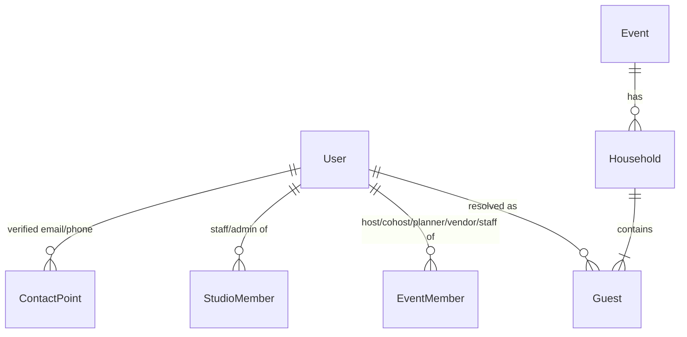
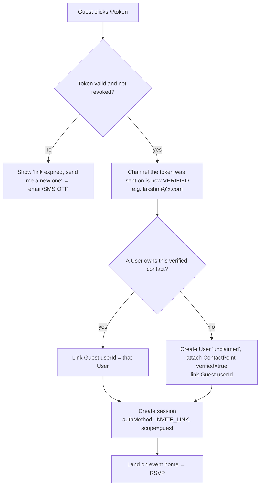

# 02 — Users, identity and roles

## 1. Two kinds of "person"

The core decision is that **a guest-list entry and a user account are different things**.

| Concept | Scope | Created by | Example |
|---|---|---|---|
| **User** | Global (platform) | The first verified sign-in, or the first invitation click | Lakshmi Rao. Has a verified email and phone, and appears in 3 events across 2 studios. |
| **Guest** | One event | Host import or entry | "Lakshmi Rao" on the Priya & Arjun guest list, member of the "Rao Family" household |

- `Guest.userId` is **nullable**. Kids, plus-ones and relatives without contact details stay unlinked forever, and that's fine.
- One user can be linked to many guest rows, at most one per event. That link is what lets a person "see all the events they attended".
- Hosts, staff and vendors are users with **memberships**. They are not guests, although a host usually has a guest row as well.

## 2. Magic-link invitations and account resolution

Invitations go to **every adult guest (`isChild = false`) who has an email or phone, on every channel they have.** An adult with both an email and a phone receives both. Each delivery carries its own token, tied to that channel, so clicking either one verifies the channel it arrived on. Kids and adults without a contact are reached through their household. The link is `https://{slug}.yourstudio.com/i/{token}`.

Every adult in a household can RSVP for the whole household. When more than one adult answers, the most recent answer wins for each guest and sub-event, and the audit trail keeps every change.

Rules:

1. **Clicking the link verifies the channel.** If the email was sent to `lakshmi@x.com` and someone clicked it, they control that inbox, or someone forwarded it, which is an accepted risk for guest scope. Every page offers "Not you? Get your own link".
2. **Never auto-link on an unverified match.** If a host types `lakshmi@x.com` for a guest, the platform does **not** join that guest to an existing user until the link is clicked or a code is entered. A host typo would otherwise expose another person's event history.
3. **Invitation links can be used many times.** People reopen old emails. A link stays valid until the event ends plus 90 days. Rotating it (the host's "resend invite") revokes the old one.
4. **An invitation session is guest-scoped only.** It can RSVP, view the site and gallery, favorite photos and run face search. Anything else requires a fresh OTP or magic-link login. That includes host or staff powers, buying, viewing other events, and editing the profile.
5. **Upgrading is optional.** "Save your account" adds a second contact point or a passkey and sets the user to `CLAIMED`. Nothing is lost if they never do this.
6. **The household responder.** Whoever opens a household's invitation can RSVP for **every member of that household**, including kids and plus-ones. The response records `respondedByUserId` for audit.

### Merging duplicate users

A person might get one invitation by email for wedding A and one by SMS for wedding B, which creates two users. When a signed-in user verifies a second contact point that already belongs to another user, the platform offers to merge the accounts. It requires a code sent to **both** channels, re-points `Guest`, `EventMember`, `Favorite` and `PhotoMatch`, writes an `AuditLog` entry, and soft-deletes the duplicate.

### Studio contact directory ("add existing users to new instances")

A studio sees a **Contacts** list: every user who has a guest or member relationship with any of that studio's events. When setting up a new event, the studio can pick from it to add hosts, planners or recurring vendors. In SaaS mode, studio A **never** sees that a user also has a relationship with studio B.

## 3. Roles

| Role | Scope | Typical person |
|---|---|---|
| `PLATFORM_ADMIN` | Platform | You, as the SaaS operator |
| `STUDIO_OWNER` | Studio | You, as the photographer. Handles billing, Stripe, price sheets and all events. |
| `STUDIO_STAFF` | Studio, with per-event assignment | A second shooter or editor. Can upload and curate assigned events. No billing. |
| `HOST` | Event | The couple or client |
| `COHOST` | Event | A parent or sibling. The same as a host, but can't manage other hosts or payments. |
| `PLANNER` | Event | A wedding planner. Guest list, schedule and RSVP exports. No gallery admin. |
| `VENDOR` | Event | Decorator, caterer, venue. Read-only schedule, a vendor-tagged album, and the dietary/meal report if granted. |
| `GUEST` | Event (implied by a linked `Guest` row) | Invited people |

`PLATFORM_ADMIN` and `STUDIO_OWNER` start as the same person but **must remain separate roles**, so that SaaS doesn't force a refactor.

## 4. Permission matrix (MVP + Phase 2)

✓ = allowed · ◐ = limited · — = no

| Capability | Studio owner | Studio staff | Host | Co-host | Planner | Vendor | Guest |
|---|---|---|---|---|---|---|---|
| Create event, assign template, set slug | ✓ | — | — | — | — | — | — |
| Edit content pages and schedule | ✓ | ◐ assigned | ✓ | ✓ | ✓ | — | — |
| Manage hosts, co-hosts and planners | ✓ | — | ✓ | — | — | — | — |
| Manage guest list and households, import | ✓ | — | ✓ | ✓ | ✓ | — | — |
| Send invitations, set reminder deadline | ✓ | — | ✓ | ✓ | ✓ | — | — |
| View RSVP report and meal counts | ✓ | ◐ | ✓ | ✓ | ✓ | ◐ meal counts only | — |
| RSVP | — | — | ✓ own household | ✓ | — | — | ✓ own household |
| Manage registry links and cash fund | ✓ | — | ✓ | ✓ | — | — | — |
| Mark registry item purchased | — | — | — | — | — | — | ✓ |
| Upload photos | ✓ | ✓ assigned | — | — | — | — | — |
| Create albums, publish gallery | ✓ | ✓ assigned | — | — | — | — | — |
| Hide or unhide photos and albums | ✓ | ✓ assigned | ✓ | ✓ | — | — | — |
| View gallery (visible photos) | ✓ | ✓ | ✓ incl. host-only | ✓ incl. host-only | ◐ | ◐ vendor album | ✓ |
| Face search (self) | — | — | ✓ | ✓ | — | — | ✓ |
| Face search for a child in own household | — | — | ✓ | ✓ | — | — | ✓ adults |
| Create a "remember my face" profile | — | — | ✓ | ✓ | ✓ | ✓ | ✓ adults |
| Favorites | — | — | ✓ | ✓ | — | — | ✓ |
| Proofing (album selections) | ✓ view | ✓ view | ✓ | ✓ | — | — | — |
| Download full-res / zip | ✓ | ✓ | after unlock | after unlock | — | — | after unlock |
| Buy the gallery unlock package | — | — | ✓ | ✓ | — | — | — |
| Buy prints / digital | — | — | ✓ | ✓ | — | — | ✓ |
| Set prices, Stripe, refunds | ✓ | — | — | — | — | — | — |
| Turn face search off for an event | ✓ | — | ✓ request | — | — | — | — |
| Set face-index retention window | ✓ (platform admin too) | — | — | — | — | — | — |
| Purge face index now | ✓ | — | ✓ request | — | — | — | ◐ remove self |

This is implemented as a single `can(user, action, resource)` policy function in `packages/shared`, used by both server actions and the UI. Every check is unit-tested against this table.

## 5. Site and gallery access

**The entire event site, including the gallery, is for invited guests only.** A viewer must have one of these:

- a guest row in the event that is linked to their user, or
- an event or studio membership.

There are no PIN or share links. Consequences:

- **Guests without a contact point** (kids, some relatives) see the gallery through a household member's session, using the household's "Family photos" tab.
- **Someone who wasn't invited to the website but should see photos** is added by the host as a guest. The host can mark them "gallery only", which means no sub-event invitations.
- **Vendors** see only albums flagged `vendorVisible`.

## 6. Visibility of photos

- An album has a visibility of `GUESTS`, `HOSTS_ONLY` or `HIDDEN`. `HIDDEN` means only studio staff can see it.
- A photo has its own `hidden` flag. A photo's **effective visibility is the most restrictive of the photo flag and its album's visibility**.
- Face search results and zips always pass through the same visibility filter as gallery listings, so there is no side channel.
