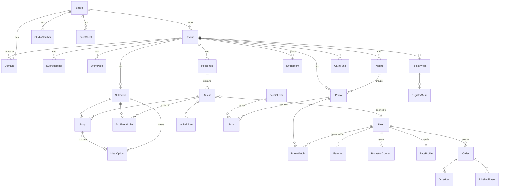

# 03 — Data model

The full draft is in [schema.draft.prisma](schema.draft.prisma). This document covers the shape of the model and the reasoning behind it.

## 1. Domains at a glance

| Group | Tables |
|---|---|
| Identity | `User`, `ContactPoint`, `Session` |
| Tenancy | `Studio`, `StudioMember`, `Domain`, `Event`, `EventMember` |
| Site content | `EventPage`, `SubEvent`, `MealOption` |
| Guests and RSVP | `Household`, `Guest`, `SubEventInvite`, `Rsvp`, `InviteToken` |
| Messaging | `Message`, `ReminderRule` |
| Registry | `RegistryItem`, `RegistryClaim`, `CashFund`, `Contribution` |
| Media | `Album`, `Photo`, `Face`, `FaceCluster`, `PhotoMatch`, `Favorite`, `ProofingList`, `ZipExport` |
| Privacy | `BiometricConsent`, `FaceProfile`, `AuditLog` |
| Commerce | `PriceSheet`, `Product`, `Order`, `OrderItem`, `Entitlement`, `PrintFulfillment` |
| Infrastructure | `Job` |

## 2. Key modelling decisions

1. **Studio sits above Event from day one.** There's only one studio today, but adding a tenant level above every row later would mean migrating every table. Adding it now costs one column.
2. **`Guest` is separate from `User`.** See [02-users-and-roles.md](02-users-and-roles.md). `Guest.email` and `Guest.phone` are *what the host typed*, which is unverified. `ContactPoint` holds *what a person proved they own*, which is verified and globally unique. Only `ContactPoint` can link a guest to a user.
3. **Invitations to sub-events are per guest, not per household.** That handles "adults only at the sangeet". The host UI works at household level with a per-member override, and writes `SubEventInvite` rows for each guest.
4. **There is one `Rsvp` row per guest × sub-event**, created as `PENDING` when the invite row is created. Reminder queries, headcounts and meal counts then become simple `GROUP BY`s.
5. **Plus-ones are placeholder `Guest` rows** with `isPlusOne = true`. When the household RSVPs, the placeholder gets a name, so the plus-one can later receive a link, be linked to a user, and use face search.
6. **Meal options belong to the sub-event** (`servesMeal`), because a haldi usually has no meal choice and a reception does.
7. **`LocalizedText` is JSON.** That's simpler than a translations table for the size of fixed-page content. Fallback order is the requested locale, then the event default, then English. UI chrome uses message catalogs, not the database.
8. **Visibility is stored at two levels.** `Album.visibility` and `Photo.hidden` resolve to an effective visibility in a single SQL view, `visible_photos(viewer_role)`. Listings, face search and zips all read from that view.
9. **Biometric data lives in exactly three places:**
   - `Face.embedding`, purged with the face index.
   - `FaceCluster`, deleted together with its faces.
   - `FaceProfile.embedding`, which is opt-in for adults only, deleted when revoked, and purged after `purgeAfter` (3 years from last use).

   `BiometricConsent` records who consented, for whom (themselves or a child guest), and for what (one search, guardian search, or profile). A purge is a few `DELETE`s plus an `AuditLog` row, which keeps the CUBI story simple to prove.
10. **`PhotoMatch` is deliberately not biometric.** It's a list of photo IDs, so the "My photos" page keeps working after the face index is purged. Each match has exactly one subject: a `userId` for adults, or a `subjectGuestId` for a child searched by a guardian. A `CHECK` constraint enforces that, and the household's "Family photos" tab is a join through `Guest.householdId`.
11. **Entitlements are separate from orders.** A host package paid outside Stripe, a comped gallery, or a print-only order all reduce to "does an `Entitlement` cover this user and photo?" `userId = null` means everyone with gallery access.
12. **The job queue lives in Postgres.** It's portable and transactional: a job is enqueued in the same transaction as the row that caused it, so no job is lost and none points at a missing row. `dedupeKey` prevents duplicate face-cluster jobs per upload batch.
13. **Tenant scoping is enforced in the client.** A Prisma `$extends` wrapper requires a `TenantContext { studioId, eventId? }` for all tenant models and injects `where` filters. Postgres row-level security will be added as defence in depth before other studios join.

## 3. Indexing notes

- **Faces:** search is an exact cosine scan filtered by `eventId`, which covers up to about 15,000 faces per event using the `@@index([eventId])` btree. No HNSW index is needed until cross-event search exists, and it may never be needed.
- **Photos:** the composite index on `(eventId, albumId, sortKey)` serves gallery pagination. Paginate with keyset cursors, not offsets.
  - **`Photo.sortKey` contract** (WEB-017). The worker writes the capture time (else `createdAt`) as a naive, fixed-width ISO-8601 string with milliseconds, e.g. `2026-03-04T05:06:07.089` (`sort_key()` in `hub_worker/handlers/process_photo.py`). Fixed width is what makes plain string comparison chronological. The backfill migration `backfill_photo_sortkey` writes the same format in SQL (`to_char(COALESCE("capturedAt","createdAt"), 'YYYY-MM-DD"T"HH24:MI:SS.MS')`). Studio reordering (ADM-017) may write other strings; they only need to sort correctly as text.
  - **Order:** `sortKey ASC NULLS LAST, id ASC`. Photos without a key sort last and are never dropped; `id` breaks ties, so a page boundary can fall inside a run of equal keys. The web gallery (`apps/web/src/lib/gallery.ts`), the ZIP builder (`build_zip.py`) and the `/api/gallery/*` cursors all use this order. A cursor is base64url of `${sortKey}|${id}`; "no key" is a NUL byte in the key slot so it never collides with an empty-string key. My photos orders by `score DESC, photoId ASC`.
  - Tests that pin the contract: `workers/media/tests/test_process_photo.py` (format, and equality with the SQL `to_char`), `packages/db/src/photoSortKeyBackfill.test.ts`, `apps/web/src/lib/gallery.test.ts`, `workers/media/tests/test_build_zip.py`.
- **RSVP reports:** `Rsvp(subEventId, status)`. Done (ADM-009, migration `rsvp_index`); the report page and CSV exports use it.
- **Messages:** an index on `(providerId)` for webhook lookups.

## 4. What is not modelled yet (deliberately)

- Seating charts and table assignments
- Guest uploads and a shared guest album. Studio-only uploads were confirmed.
- PIN or share links for galleries. Access is for invited guests only (confirmed); a `galleryOnly` guest covers people who should see photos without being invited to sub-events.
- Studio subscription billing (Phase 3 SaaS)
- Block-based page builder. Fixed page types were confirmed.
- Vendor directory across events. For now, the studio contact list covers repeat vendors.
